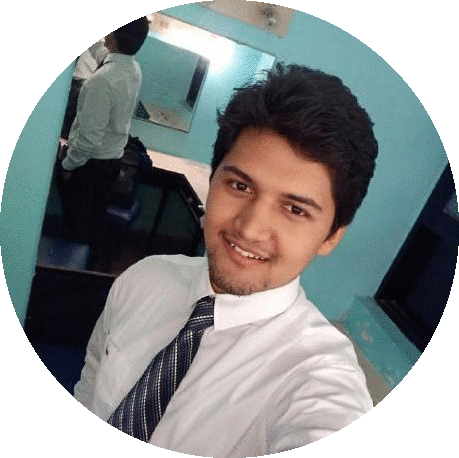

## About

I am Manash Pratim Das, a final year undergraduate student at the Indian Institute of Technology, Kharagpur. I am pursuing research in the field of Robotics. Specific research topics that I am interested and experienced in are: **Perception**, **Motion Planning**, **Computer Vision** and **Aerial Robotics**.  
 
My aim is to contribute towards Artificial Intelligent systems that can augment human in tasks that are space or time critical for a human to operate in. Through courses, internships and projects, I itend to gain on the experience and knowledge that would enable me to better advance towards my goal.  
 
My curriculum vitae can be found in this link: [curriculum-vitae](https://manashpratim.com/ManashCV.pdf) (Last updated: November 2, 2017)
